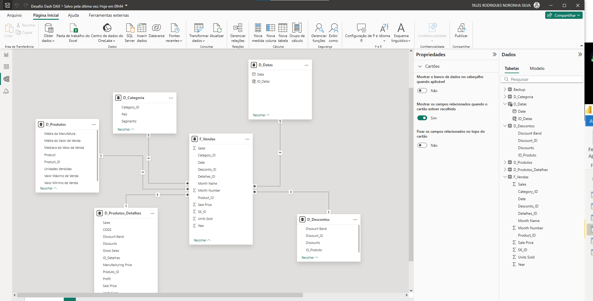
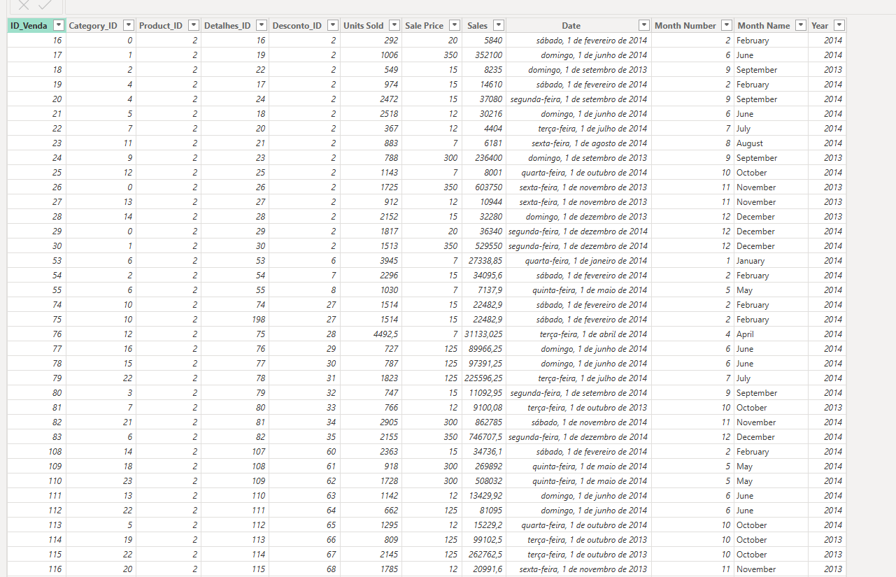
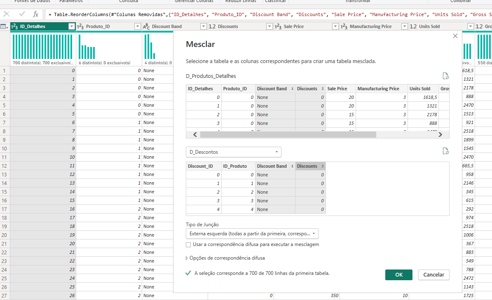
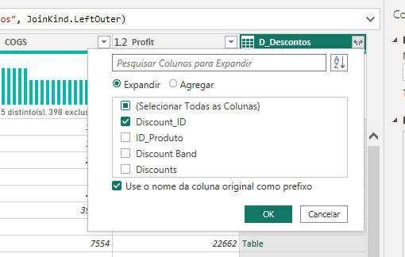
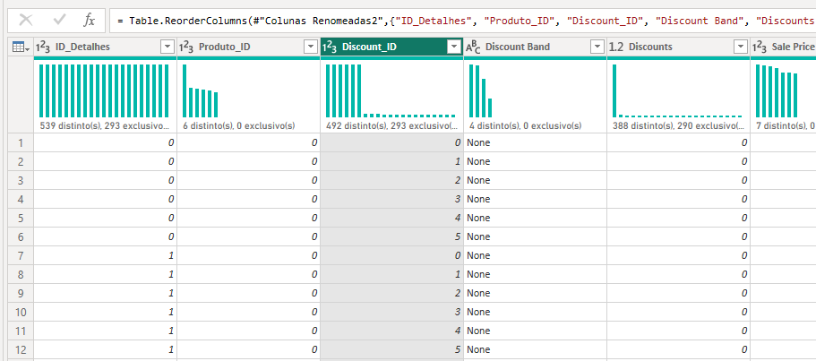
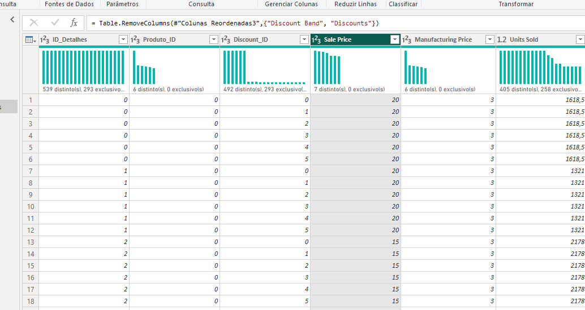
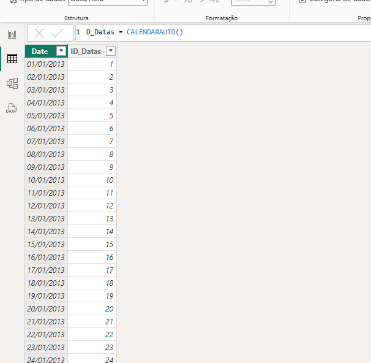

# Modelando um Dashboard de E-commerce com Power BI Utilizando Fórmulas DAX

Utilizando a base de dados Financial Sample, criamos um modelo Star-Schema centrado nas vendas como tabela fato, e com cinco dimensões:
Produtos, Categoria, Descontos, Data e Detalhes.

Imagem do diagrama:



Formatação da tabela F_Vendas:



Para a criação das tabelas, seguimos na maior parte o procedimento informado pela instrutora. Mas em vez de inserir tabelas condicionais para fazer os IDs, nós primeiro:
1. Inserimos uma Coluna Índice para Cada Tabela,
2. Mesclamos cada tabela à tabela fato de modo a resgatar a coluna de IDs para cada uma,
3. Apagamos as informações desnecessárias.

Exemplo do processo:

Resgatando o ID do desconto para a tabela de Detalhes






### Tabela Data:
Para a tabela data, usamos a fórmula DAX CALENDARAUTO(), e alteramos a formatação na própria tabela.



Para a criação do ID das datas, nós usamos a seguinte função:

```
ID_Datas = RANKX(D_Datas, 'D_Datas'[Date], , ASC)
```

Através dessa fórmula, é possível criar um índice para qualquer tabela personalizada.

### Considerações Finais

O que se percebeu durante o processo é que boa parte da modelagem é melhor feita no próprio SQL. Por exemplo, a indexação e substituição dos valores nominais pelo índice seria mais interessante na própria base de dados, em vez de executado pelo Power BI. De todo modo, o software apresenta ferramentas poderosas para tal modelagem.